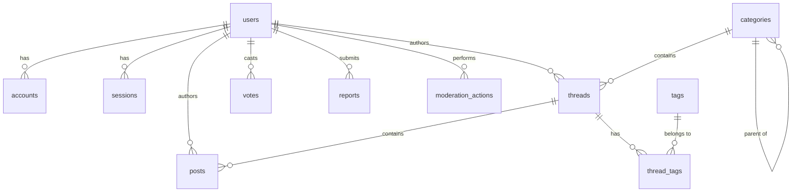

# Minimalist Forum

A high-performance, minimalist discussion forum web application built with Next.js (App Router), Tailwind CSS v4, Drizzle ORM, Neon PostgreSQL (with a local PGlite fallback), and Auth.js (NextAuth).

---

## Table of Contents

1. [Architecture & Key Design Decisions](#architecture--key-design-decisions)
   - [PGlite Local Fallback](#1-pglite-local-fallback)
   - [JWT Session Strategy with Instant Revocation](#2-jwt-session-strategy-with-instant-revocation)
   - [Flat Reply Structure](#3-flat-reply-structure)
   - [Stateless Database Batching](#4-stateless-database-batching)
2. [Database Schema & Models](#database-schema--models)
3. [Project Directory Structure](#project-directory-structure)
4. [Getting Started & Local Setup](#getting-started--local-setup)
   - [Prerequisites](#prerequisites)
   - [Installation](#installation)
   - [Environment Configuration](#environment-configuration)
   - [Database Seeding](#database-seeding)
   - [Running Development Server](#running-development-server)
5. [Testing Suite](#testing-suite)
   - [Running Tests](#running-tests)
   - [Writing Tests](#writing-tests)

---

## Architecture & Key Design Decisions

The application is engineered to balance performance, simplicity, and low operational overhead. Several critical architecture decisions were made to address the unique challenges of serverless environments and local developer workflows.

### 1. PGlite Local Fallback
To solve the dependency footprint of local development, the app uses `@electric-sql/pglite` (a WASM compilation of Postgres) when `DATABASE_URL` is not defined in the environment.
- **Zero-Dependency Bootstrapping**: Developers do not need to install Postgres locally or set up Docker containers. Running `npm run dev` or `npm test` automatically boots a transient or disk-backed in-process Postgres instance.
- **In-Memory Testing**: The test suite instantiates a clean, in-memory PGlite client and runs migrations programmatically before every test block, ensuring database-dependent tests are fast, fully isolated, and require zero configuration.

### 2. JWT Session Strategy with Instant Revocation
Auth.js enforces the JSON Web Token (JWT) strategy when using a `Credentials` provider. Stale claims in a JWT can normally outlive administrative actions (like banning a user or a password reset) unless session revocation is designed explicitly.
- **Revocation Ledger**: We store a `sessionsValidAfter` timestamp on the `users` table.
- **Callback Verification**: The NextAuth `session` callback intercepts every request, queries the database for the user's current status (`isBanned`, `isDeleted`, `sessionsValidAfter`), and validates the token's issue time (`iat`).
- **Instant Effect**: If the user has been banned, deleted, or reset their password since the token was issued, the session is instantly invalidated.

### 3. Flat Reply Structure
To prevent recursive database queries, deep joins, or virtualized list performance problems, posts/replies within a thread are rendered in a flat list.
- **Future Extensibility**: A nullable `parentPostId` field exists in the `posts` schema, allowing quote-replies or reply target annotations to be introduced without structural schema changes.

### 4. Stateless Database Batching
In serverless environments (like Vercel), pool-based database connections can easily exhaust limit limits. The production database connector uses Neon's HTTP driver, which communicates over stateless HTTP requests.
- **No Long-Lived Transactions**: Interactive transaction blocks (`db.transaction(...)`) require a persistent session connection and are unsupported over Neon HTTP.
- **Batch Operations**: Multi-statement operations (such as creating a reply, which inserts a post, updates the thread counters, and updates user activity) use Drizzle's `db.batch([...])` utility, which Neon runs atomically in a single round-trip.

---

## Database Schema & Models

The database schema is declared in [schema.ts](file:///Users/sudhinlal/Documents/trae_projects/forum_minimalist/src/lib/db/schema.ts) using Drizzle ORM.



### Core Tables

1. **`users`**: Manages member accounts, roles (`member`, `moderator`, `admin`), ban status, soft deletion flags, and credentials/OAuth profile metadata.
2. **`categories`**: Defines navigation sections and sub-categories (using a self-referencing `parentId`). Supports markdown descriptions for topic landing pages.
3. **`threads`**: Individual forum discussion threads. Features denormalized counters (`replyCount`, `voteScore`, `viewCount`) for performance and a generated `tsvector` column (`searchVector`) for full-text search.
4. **`posts`**: Individual replies inside a thread. Tracks edit history and revision counts.
5. **`post_revisions`**: Audit ledger recording previous post bodies to track editing history.
6. **`tags` & `thread_tags`**: Tagging system facilitating categorical search and related thread calculations.
7. **`votes`**: Tracks user upvotes/downvotes on threads and posts. Restrained at the database level using a check constraint (`value IN (-1, 1)`) and unique index per user-target pair.
8. **`reports` & `moderation_actions`**: Moderation queues and logs recording reporter details, flag reasons, resolution notes, and actions taken (e.g. `lock`, `pin`, `ban`, `delete`).
9. **`auth_attempts`**: A sliding-window ledger used by Postgres to rate-limit authentication endpoints without requiring an external Redis instance.

---

## Project Directory Structure

```
├── drizzle/                  # Drizzle ORM migrations and schema snapshots
├── public/                   # Static assets (avatars, icons)
├── src/
│   ├── app/                  # Next.js App Router routes & layouts
│   │   ├── (auth)/           # Authentication routes (/login, /signup)
│   │   ├── actions/          # Server Actions (create thread, reply, vote)
│   │   ├── api/              # API Route Handlers
│   │   ├── c/                # Category and Thread views (/c/[category]/[thread])
│   │   ├── u/                # Public profiles (/u/[username])
│   │   ├── page.tsx          # Homepage
│   │   └── globals.css       # Tailwind CSS variables and setup
│   ├── components/           # Reusable React components (UI components, Navigation)
│   ├── lib/                  # Application core logic
│   │   ├── auth/             # Session verification, permissions, rate-limiting
│   │   ├── db/               # Database client connection and Drizzle schema
│   │   ├── mutations/        # Business mutations (write queries with authorization)
│   │   └── queries/          # Read-only database access queries
│   └── auth.ts               # Auth.js / NextAuth initialization
├── next.config.ts            # Next.js configuration
├── package.json              # NPM dependencies & task runners
└── tsconfig.json             # TypeScript configuration
```

---

## Getting Started & Local Setup

### Prerequisites
- Node.js 20.x or higher
- NPM 10.x or higher

### Installation
Clone the repository and install project dependencies:
```bash
npm install
```

### Environment Configuration
Copy the sample environment template and populate it:
```bash
cp .env.example .env.local
```

Key environment parameters:
- `DATABASE_URL`: Your Neon Postgres connection URL. *Omit this in local development to fall back to PGlite.*
- `AUTH_SECRET`: A secure key used to sign tokens (generate via `npx auth secret`).
- `RESEND_API_KEY`: API key for email delivery (verification tokens).

### Database Seeding
To seed your local database (PGlite) with initial categories, dummy users, and discussion threads:
```bash
npm run db:seed
```

### Running Development Server
Launch the local Next.js development server:
```bash
npm run dev
```
Open [http://localhost:3000](http://localhost:3000) in your browser to view the forum.

To inspect the local PGlite database visually:
```bash
npm run db:studio
```

---

## Testing Suite

Unit tests in this project are written using the native Node.js test runner (`node:test`) and executed via the `tsx` wrapper. 

### Running Tests
Execute the full test suite (database migrations will run in memory automatically):
```bash
npm test
```

### Writing Tests
- Group tests logically in `.test.ts` files adjacent to the source code (e.g. `src/lib/queries/profile.test.ts`).
- For database-dependent tests, import `createDevDb` from `src/lib/db/dev` within a `before()` hook to initialize a transient Postgres database:
```typescript
import assert from "node:assert/strict";
import { before, describe, it } from "node:test";
import { createDevDb } from "../db/dev";
import type { AppDb } from "../db/types";

let db: AppDb;

before(async () => {
  db = await createDevDb(); // Boots in-memory database and applies migrations
});
```
